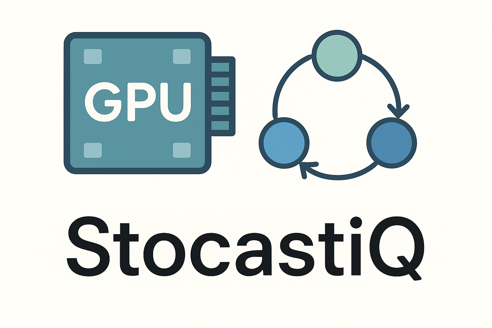

# 🎲 StocastiQ: Stochastic Process Modeling of Datacenter GPU Resource Utilization

<p align="center">
  
</p>


---

## 📚 Overview

**StocastiQ** is an **interactive Streamlit dashboard** that applies **stochastic process techniques** — **Markov Chains**, **Hidden Markov Models (HMMs)**, and **Queueing Theory** — to analyze **GPU resource utilization** and **job state transitions** in a datacenter environment.

We leverage a curated sample from the **MIT SuperCloud Datacenter Challenge dataset** (\~2 TB of SLURM job logs) to uncover patterns of GPU job lifecycles, hidden states of system load, and queueing performance.

This project demonstrates how **stochastic modeling** can provide insights into **HPC (High-Performance Computing)** environments, resource bottlenecks, and scheduling dynamics.

---

## 📂 Dataset

We used the **MIT SuperCloud Datacenter Challenge** dataset, publicly hosted on AWS S3.

Example of accessing raw data:

```bash
aws s3 ls s3://datacenter-challenge/202201/ --no-sign-request
```

### Structure

* `cpu/` and `gpu/` folders
* Sub-folders `0000/` → `0099/` for partitioned job data
* Each job includes:

  * `*-summary.csv` → metadata (submit/start/end, state, resources requested)
  * `*-timeseries.csv` → utilization metrics sampled during runtime

Since the full dataset is \~**2 TB**, we **extracted GPU subsets** for tractable analysis.

### Key Features Extracted

| Category             | Columns                                                                              |
| -------------------- | ------------------------------------------------------------------------------------ |
| **Resource metrics** | `CPUUtilization`, `RSS`, `VMSize`, `IORead`, `IOWrite`, `Threads`, `ElapsedTime`     |
| **Job metadata**     | `time_submit`, `time_start`, `time_end`, `state`, `cpus_req`, `mem_req`, `partition` |

---

## ⚡ Challenges & Solutions

| Challenge                     | Our Approach                                                                                         |
| ----------------------------- | ---------------------------------------------------------------------------------------------------- |
| **Data size (\~2 TB)**        | Used **AWS CLI** with `--no-sign-request` and **sampled GPU jobs** locally                           |
| **Lack of state definitions** | Cross-referenced SLURM docs with timeseries to infer states                                          |
| **State representation**      | Discretized `CPUUtilization` into:<br>0 = Idle (< 30 %)<br>1 = Normal (30–70 %)<br>2 = Busy (≥ 70 %) |
| **Sparse state coverage**     | Built emission matrices tolerant to missing symbols                                                  |
| **Result validation**         | Iteratively compared against **domain expectations** (steady-state, emissions, queueing outcomes)    |

---

## 💻 Dashboard Modules

The **Streamlit app** is divided into four modules:

| Module                    | Features                                                                   |
| ------------------------- | -------------------------------------------------------------------------- |
| **Home**                  | Narrative walkthrough of dataset, challenges, and approach                 |
| **Markov Chain Analysis** | Transition matrix, steady-state distribution, state visualizations         |
| **Hidden Markov Model**   | Emission probabilities, forward/Viterbi algorithms, hidden state inference |
| **Queueing Theory**       | Arrival/service rates, expected wait time, queue simulations               |
| **Visualizations**        | Matplotlib charts for distributions, transitions, and queues               |

---

## 🚀 Getting Started

### 1️⃣ Clone Repository

```bash
git clone https://github.com/yourusername/stocastiq.git
cd stocastiq
```

### 2️⃣ Install Dependencies

```bash
pip install -r requirements.txt
```

Or manually:

```bash
pip install streamlit numpy pandas hmmlearn matplotlib
```

*(Optional)*: Install **AWS CLI** for dataset access:

```bash
sudo apt-get install awscli
```

### 3️⃣ Run the App

```bash
streamlit run app.py
```

---

## 📊 Example Outputs

* **Transition Matrix**: Probability of job moving Idle → Normal → Busy
* **Steady-State Distribution**: Long-term probability of system load states
* **HMM Emissions**: Hidden system behavior from observable metrics
* **Queue Simulations**: Expected wait times under varying loads

---

## 📁 Repository Structure

```
stocastiq/
│── app.py                  # Streamlit dashboard
│── requirements.txt        # Python dependencies
│── data/                   # Sample extracted GPU job logs
│── modules/
│    ├── markov_chain.py    # Markov Chain analysis
│    ├── hmm_model.py       # Hidden Markov Model analysis
│    ├── queueing.py        # Queueing simulations
│    └── utils.py           # Helpers (data loading, preprocessing)
│── README.md               # Project documentation
```

---

## 🎓 Acknowledgments

* **MIT SuperCloud Datacenter Challenge** for open dataset access
* **SLURM scheduler documentation** for state mappings
* Developers of **hmmlearn**, **streamlit**, and **matplotlib**

---

## 📜 License

This project is licensed under the **MIT License** — free to use, modify, and distribute with attribution.

---

## 🙌 Contributing

Contributions are welcome!

1. Fork the repo
2. Create your feature branch: `git checkout -b feature/awesome-feature`
3. Commit your changes: `git commit -m 'Add awesome feature'`
4. Push to branch: `git push origin feature/awesome-feature`
5. Open a Pull Request

---

✨ *StocastiQ brings stochastic process modeling to the heart of datacenter GPU workloads — uncovering hidden states, long-term behaviors, and queue dynamics in HPC environments.*

---

